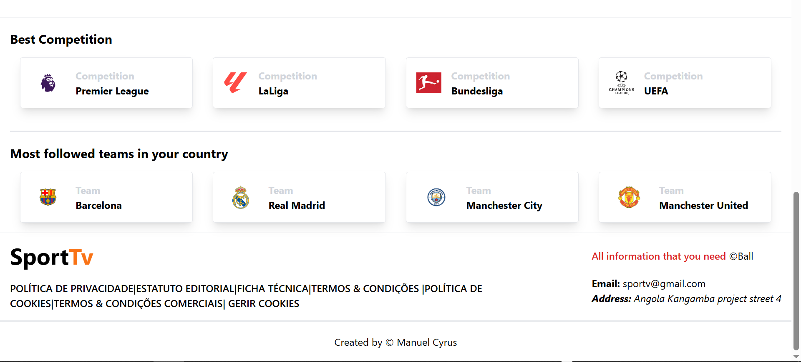

# SportTv
Um site para monitorar e gerenciar atividades esportivas, ajudando atletas e entusiastas do esporte a acompanhar seu desempenho e atingir seus objetivos.


## Tecnologias Utilizadas

- HTML, CSS, JavaScript    
- API do Spotify  

## 📸 Prévia do Projeto  
Aqui está uma prévia de como ficou o projeto:  

 

## 📂 Como executar o projeto  
1. Clone este repositório:  
   ```sh
   git clone https://github.com/ManuelCyrus/SportTv.git